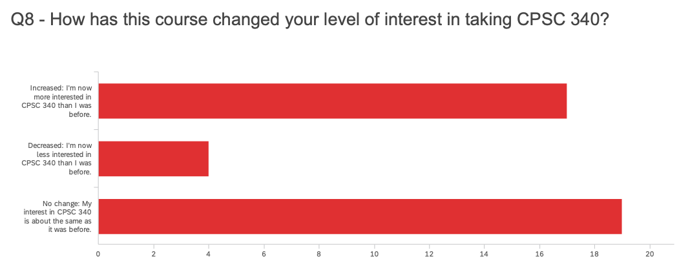
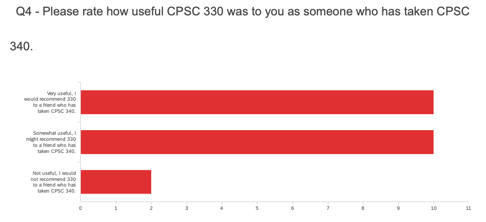
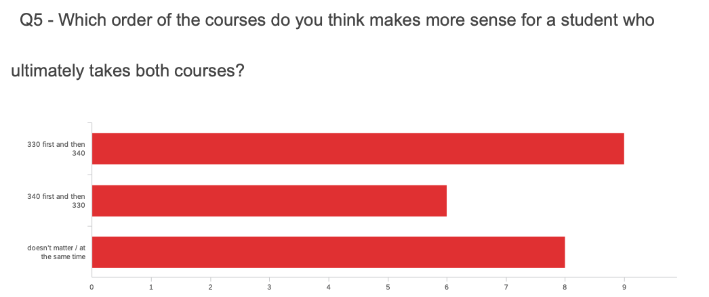
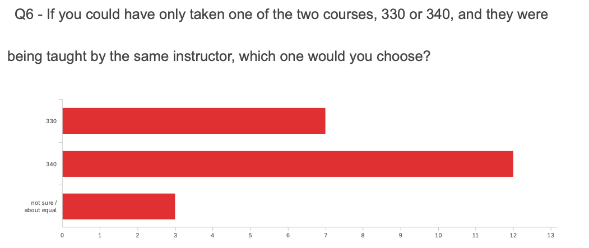

## CPSC 330 vs. CPSC 340

CPSC 330 is a course in applied machine learning, and is closely related to the field of data science. 
The course is about using systems that learn from data to make predictions or produce insights. 

There is overlap between CPSC 330 and [CPSC 340](https://www.students.cs.ubc.ca/~cs-340/). However, CPSC 330 is about _using_ machine learning whereas 
CPSC 340 involves _implementing_ machine learning algorithms from scratch. CPSC 330 is broader, 
and includes topics like data cleaning and communicating your results; CPSC 340 goes deeper into the
algorithms and the mathematical / numerical considerations underlying them. CPSC 340 has many more prerequisites, 
especially in terms of math courses. The best choice will depend on your interests and goals. 
It is also perfectly reasonable to take both courses (more on this below).

Topics that are only in CPSC 330:

- build an ML pipeline
- data cleaning
- time series data
- natural language processing
- communicating your results
- and more

Topics that are only in CPSC 340:

- probabilistic models
- optimization and loss functions (this is a **major** topic in CPSC 340)
- dimensionality reduction
- and more

Topics that appear in both courses (but typically in a very different way):

- basic classification and regression methods: decision trees, KNN, etc.
- fundamentals of learning
- clustering
- recommender systems
- deep learning

At the end of the first offering of CPSC 330 (Jan-Apr 2020), I surveyed the class about the relationship between these two courses. I am reproducing the results below. The first part of the survey was for students who had **not** previously taken CPSC 340. Here are the results:

The next part of the survey was for students who **had** already taken CPSC 340. Here are the results:

